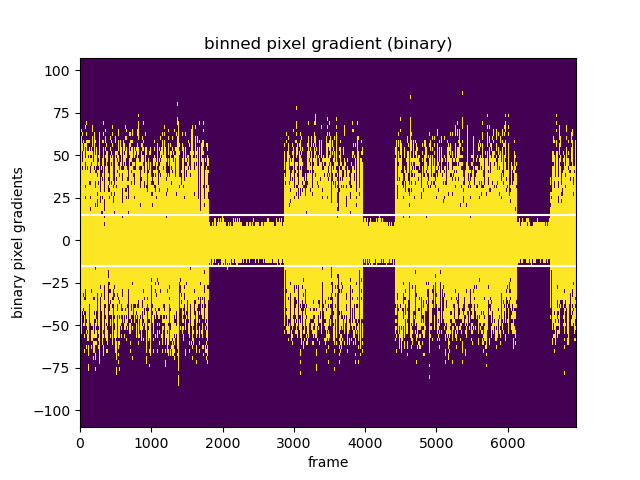
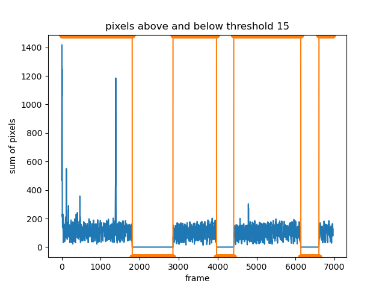

# Still Frames Analysis

Extract ranges of frames with and without movement.
See `.ipynb` file for how this works.

# Example output
Results of the analysis where a fly is alternating between grooming 
and completely stopping.





```
Frames     1 to  1810:  on
Frames  1811 to  2855: off
Frames  2856 to  3973:  on
Frames  3974 to  4413: off
Frames  4414 to  6135:  on
Frames  6136 to  6600: off
Frames  6601 to  6960:  on```
